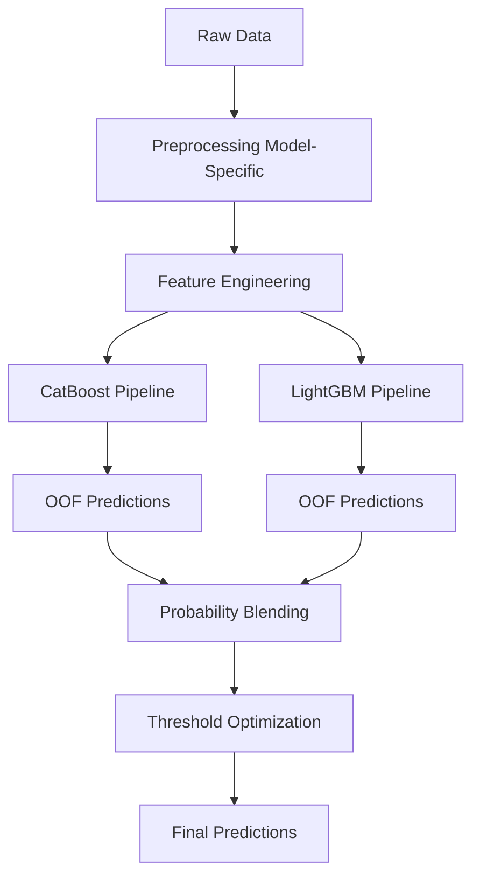

# 📊 Predicting SME Financial Health using Machine Learning

> A production-ready machine learning pipeline for predicting SME Financial Health categories using ensemble modeling, probability blending, and threshold optimization.

---

## 🚀 Project Overview

Small and Medium Enterprises (SMEs) are critical to economic growth but often face financial instability. Traditional metrics like revenue alone fail to capture their true financial health.

This project builds a **robust classification system** to predict SME Financial Health Index (FHI) categories:

- 🟢 High
- 🟡 Medium
- 🔴 Low

The solution leverages:
- Advanced feature engineering
- Dual-model architecture (CatBoost + LightGBM)
- Cross-validation with out-of-fold predictions
- Probability blending
- Threshold optimization for imbalanced classification

---

## 🧠 Problem Statement

Accurately classifying SME financial health is challenging due to:

- Imbalanced class distribution
- Complex interactions between financial and behavioral variables
- Overlap between adjacent classes (High ↔ Medium ↔ Low)

The goal is to build a **generalizable model** that:

- Maximizes **Macro F1-score**
- Improves detection of minority classes
- Maintains robustness across validation folds

---

## 🏗️ Solution Architecture

### 🔄 Machine Learning Pipeline



---

## ⚙️ Models Used

### 🐱 CatBoost
- Native handling of categorical variables
- Robust to minimal preprocessing
- Strong performance on tabular data

### 🌳 LightGBM
- Fast gradient boosting framework
- Efficient with engineered numerical features
- Strong generalization performance

---

## 🔀 Ensemble Strategy

Instead of choosing a single model, this project uses:

### ✅ Weighted Probability Blending

- **35% CatBoost**
- **65% LightGBM**

```python
final_proba = 0.35 * cat_proba + 0.65 * lgb_proba
```
## 🎯 Threshold Optimization

Rather than using the default **argmax**, class-specific thresholds were optimized:

```python
High   → 0.50  
Low    → 0.45  
Medium → 0.40
```
This improves:

+ Minority class recall
+ Overall Macro F1 performance

## 📈 Model Performance
### 🔹 Cross-Validation Results

| Model    | OOF Macro F1 |
| -------- | ------------ |
| CatBoost | 0.8092       |
| LightGBM | 0.7989       |
| Ensemble | **0.8156**   |

### 🔹 Final Ensemble (Threshold Optimized)
+ Macro F1: 0.8161
+ Accuracy: 0.88

### 🔹 Classification Report

| Class  | Precision | Recall | F1-score |
| ------ | --------- | ------ | -------- |
| High   | 0.85      | 0.65   | 0.73     |
| Low    | 0.89      | 0.97   | 0.93     |
| Medium | 0.85      | 0.73   | 0.79     |

## 📊 Key Insights

### 1️⃣ Ensemble Learning Outperforms Individual Models

Combining CatBoost and LightGBM improves performance beyond either model alone.

### 2️⃣ Probability Calibration Matters

LightGBM contributed more weight (65%) due to better probability calibration.

### 3️⃣ Threshold Optimization Boosts Minority Class Detection

Custom thresholds improved recall for the High (minority) class, which is critical in financial risk applications.

### 4️⃣ Class Confusion Reflects Real-World Structure

Most errors occur between adjacent classes (High ↔ Medium ↔ Low), indicating:

+ The model learned meaningful financial gradients
+ Not random misclassification

## 🧪 Reproducibility

### 📦 Install Dependencies

```python
pip install -r requirements.txt
```
### 🏋️ Train Model
```python
python -m src.train
```
### 🔮 Run Inference
```python
python -m src.infer
```
## 📂 Project Structure

```
.
├── src/ # Core machine learning pipeline
│ ├── train.py # Training pipeline (CV + ensemble + blending)
│ ├── infer.py # Inference pipeline (prediction + submission)
│ ├── preprocessing.py # Data cleaning and preprocessing logic
│ └── features.py # Feature engineering functions
│
├── notebooks/ # Research, experimentation, and analysis
│ ├── 01_preprocessing_validation.ipynb # Validation notebook for the preprocessing pipeline
│ ├── 02_feature_engineering_validation.ipynb # Validation notebook for the feature engineering pipeline
│ ├── Notebook 01 - Data Ingestion & Audit.ipynb # Schema table, Data quality report
│ ├── Notebook 02 - EDA_SME Financial Health (FHI).ipynb # # Exploratory Data Analysis (EDA)
│ ├── Notebook 03 - Baselines + Validation Strategy.ipynb # Baseline models for benchmarking
│ ├── Notebook 04 - Model 1 (CatBoost).ipynb # First Model - CatBoost
│ ├── Notebook 05 - CatBoost Optimization - Feature Engineering + Tuning.ipynb # Model optimization for CatBoost
│ ├── Notebook 06- Model 2 (LightGBM).ipynb #Second Model - LightGBM
│ ├── Notebook 07 - Model Enhancement & Ensembling.ipynb # Ensemble modeling & blending
│ ├── Notebook 08 - Feature Selection & Dimensionality Optimization.ipynb # Feature selection & dimensionality reduction
│ └── Notebook 09 — Model Explainability and Interpretation.ipynb # Model explainability (SHAP, permutation importance)
│
├── figures/ # Visualizations for analysis & README
│ ├── confusion_matrix.png
│ ├── shap_summary.png
│ └── feature_importance.png
│
├── models/ # Saved trained models & artifacts
│ ├── catboost_models.pkl
│ ├── lgbm_models.pkl
│ ├── label_encoder.pkl
│ └── oof_preds.npy
│
├── outputs/ # Final predictions & submission files
│ └── submission.csv
│
├── data/ # Dataset (not included in repo)
│ ├── Train.csv
│ └── Test.csv
│
├── requirements.txt # Project dependencies
├── README.md # Project documentation
└── .gitignore # Ignore unnecessary files
```
## 📊 Dataset

This dataset is from a Zindi competition.

👉 Due to licensing restrictions, it is not included in this repository.

To use this project:

Download dataset from Zindi: 
`https://zindi.africa/competitions/dataorg-financial-health-prediction-challenge/data`

Place files in:
`
data/Train.csv
data/Test.csv
`
## 🚀 Future Improvements
+ Hyperparameter tuning with Optuna
+ Model explainability dashboard (SHAP)
+ API deployment (FastAPI)
+ Docker containerization

  
## 👤 Author

**Henry**  
Data Scientist | Machine Learning Engineer  

- 🔗 GitHub: https://github.com/theerealhenry  
- 🔗 LinkedIn: https://www.linkedin.com/in/henry-otsyula-8926b8386
- 📧 Email: otsyulahenry@gmail.com  

📫 Feel free to reach out for collaboration, opportunities, or discussion.

## ⭐ If you found this useful

Give this repo a ⭐ and feel free to connect!
